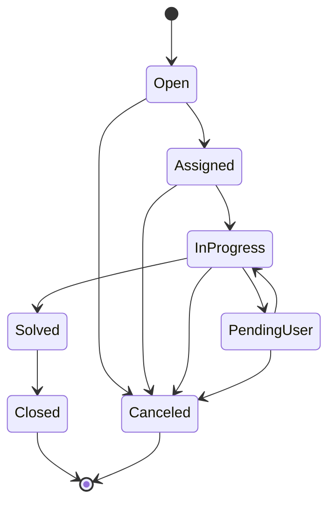

# IA4Dev — Proyecto

> Documento de requisitos de producto, a partir de las notas manuscritas del autor y sus aclaraciones posteriores. Los puntos marcados como **Pendiente** se concretarán en los requisitos que detallan este PRD.

## Driver

Mi sistema de ticketing está en JSM Datacenter. Como se ha anunciado el EOL y no quiero ir al Cloud, necesito una alternativa.

**Implicación:** la aplicación debe poder desplegarse on-premise (en infraestructura propia), sin depender de un SaaS.

## Objetivo

Tener una app web para la gestión de mis tickets.

## Arquitectura

- **Front:** React
- **Back:** AdonisJS
- **DB:** PostgreSQL

## Alcance

- CRUD de tickets
- Kanban de tickets
- Ver lista de tickets
- Ver detalle de un ticket
- Filtrar tickets
  - Listado
  - Kanban
- Explotación de información:
  - Mediante un agente de IA
  - Dashboard. **Pendiente:** aún no está claro si habrá dashboards propios o si también se generarán mediante el agente de IA.

## Tipo de ticket

- Request

## Campos del ticket

| Campo | Valor / tipo |
|-------|--------------|
| Id | Identificador del ticket |
| Tipo | Request (fijo) |
| Título | Texto |
| Descripción | Texto largo |
| Reporter | Usuario que abre el ticket. Automático |
| Assignee | Operador asignado. Vacío hasta que se asigna |
| Estado | Ver "Flujo de estados" |
| Fecha creación | Automático |
| Urgencia | 1-5 |
| Impacto | 1-5 |
| Prioridad | Automático, calculada a partir de Urgencia × Impacto y reescalada a 1-5 |
| Historial | Automático |
| Comentarios | Lista de comentarios, cada uno con su fecha |

### Cálculo de la prioridad

Urgencia × Impacto da un valor entre 1 y 25, que se reescala a 1-5.

**Propuesta** (pendiente de confirmar): `prioridad = ceil(urgencia × impacto / 5)`

| Urgencia × Impacto | Prioridad |
|--------------------|-----------|
| 1-5 | 1 |
| 6-10 | 2 |
| 11-15 | 3 |
| 16-20 | 4 |
| 21-25 | 5 |

## Flujo de estados

Flujo principal:

```
Open → Assigned → In progress → Solved → Closed
```

Estados alternativos: **Pending user** y **Canceled**.



**Pendiente de confirmar:**
- Cómo se sale de *Pending user*: ¿lo vuelve a poner el operador en *In progress*, o pasa automáticamente cuando el usuario responde?
- Desde qué estados se puede cancelar (el diagrama asume que desde cualquier estado no final).
- Si un ticket en *Solved* se puede reabrir (volver a *In progress*) cuando el usuario no está conforme.

## Roles y permisos

| Rol | Puede |
|-----|-------|
| Usuario (peticionario) | Abrir, cancelar y cerrar tickets. |
| Operador | Asignarse un ticket; pasarlo a *In progress*, *Pending user*, *Canceled* y *Solved*. |
| Supervisor | Todo lo que puede el operador y, además, asignar un ticket a un operador. |

**Pendiente de confirmar:**
- Si el usuario ve solo sus propios tickets o todos.
- Quién puede editar los campos del ticket (título, descripción, urgencia, impacto) y en qué estados.
- Si los tickets se pueden borrar (el "CRUD" incluye borrado) o solo cancelar.

