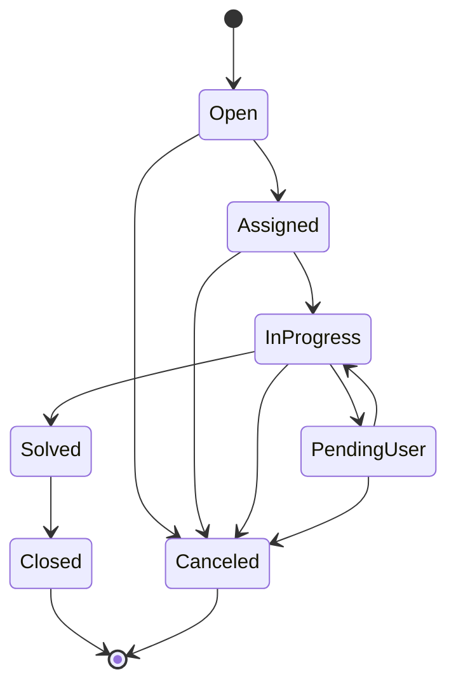
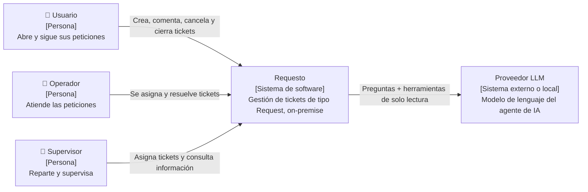
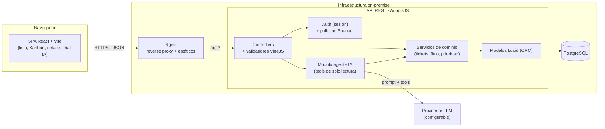
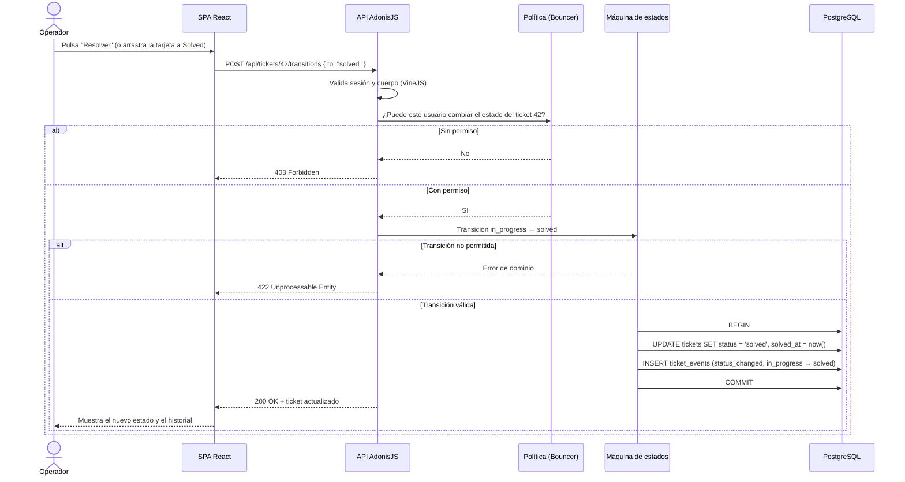
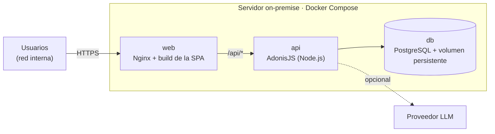
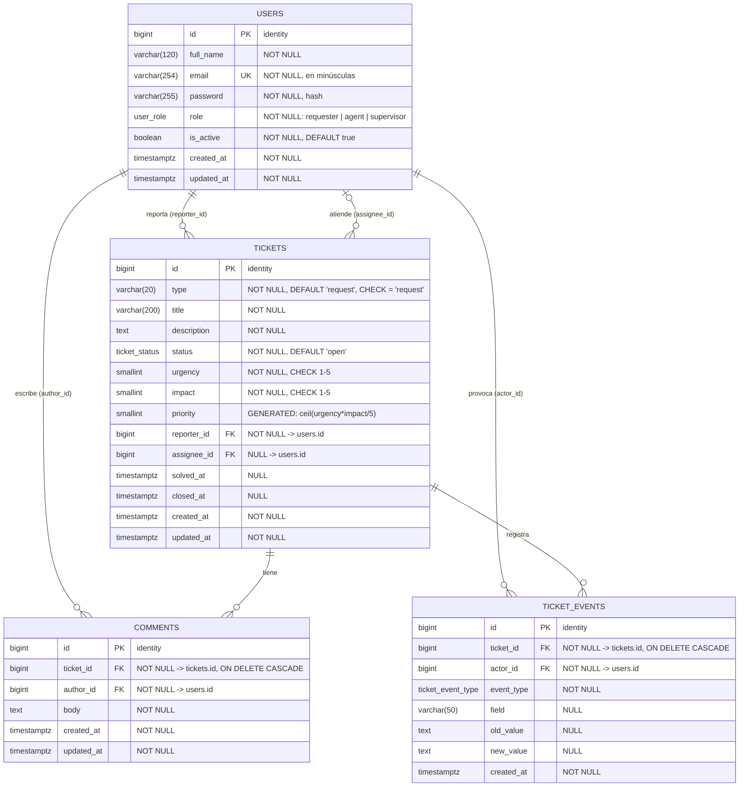

## Índice

0. [Ficha del proyecto](#0-ficha-del-proyecto)
1. [Descripción general del producto](#1-descripción-general-del-producto)
2. [Arquitectura del sistema](#2-arquitectura-del-sistema)
3. [Modelo de datos](#3-modelo-de-datos)
4. [Especificación de la API](#4-especificación-de-la-api)
5. [Historias de usuario](#5-historias-de-usuario)
6. [Tickets de trabajo](#6-tickets-de-trabajo)
7. [Pull requests](#7-pull-requests)

---

## 0. Ficha del proyecto

### **0.1. Tu nombre completo:** Pedro Lara Lara

### **0.2. Nombre del proyecto:** Requesto

### **0.3. Descripción breve del proyecto:**

Aplicación web de gestión de tickets que sustituye a **Jira Service Management (JSM) Data Center**, cuyo fin de vida ha anunciado Atlassian, sin migrar a la nube. Está pensada para desplegarse **on-premise**.

A diferencia de JSM, no es una herramienta genérica y configurable. Gestiona **un único tipo de ticket (Request)**, con un formulario fijo y un flujo de estados fijo (`Open → Assigned → In progress → Solved → Closed`, más `Pending user` y `Canceled`). Hay tres roles: el **usuario** abre sus peticiones, el **operador** las atiende y el **supervisor** las reparte y supervisa. Los tickets se consultan en lista, en Kanban y en detalle. La prioridad se calcula automáticamente a partir de la urgencia y el impacto, y un **agente de IA** permite explotar la información de los tickets.

**Stack:** React + Vite (SPA), AdonisJS (API REST), PostgreSQL y Biome, todo en TypeScript.

### **0.4. URL del proyecto:**

Pendiente: la aplicación se desplegará en la entrega final.

### 0.5. URL o archivo comprimido del repositorio

https://github.com/pedrolaralara/AI4Devs-finalproject

Rama de esta entrega: `feature/entrega-1-PLL`.


---

## 1. Descripción general del producto

### **1.1. Objetivo:**

**Qué problema resuelve.** La empresa gestiona sus peticiones internas con Jira Service Management (JSM) Data Center, instalado on-premise. Atlassian ha anunciado el fin de vida (EOL) de las versiones Data Center, y la alternativa que propone, JSM Cloud, implica sacar los datos de la infraestructura propia y asumir una suscripción SaaS, algo que no se quiere.

**Qué es Requesto.** Una aplicación web, desplegable on-premise, que sustituye a JSM para el único uso que la empresa hace de él: gestionar peticiones (*Requests*). En lugar de replicar una herramienta genérica y configurable, Requesto implementa **un solo tipo de ticket, con un formulario fijo y un flujo de estados fijo**. Eso la hace más sencilla de usar, de mantener y de desplegar.

**Qué valor aporta:**
- **Continuidad:** el servicio de tickets sigue funcionando tras el EOL de JSM Data Center.
- **Control de los datos:** todo se queda en la infraestructura de la empresa, sin dependencia de un SaaS.
- **Simplicidad:** sin configuración de tipos de issue, esquemas ni workflows que nadie usa.
- **Explotación de la información con IA:** un agente de IA responde preguntas sobre los tickets en lenguaje natural, sin tener que construir informes a mano.

**Para quién:**

| Rol | Necesidad |
|-----|-----------|
| **Usuario** (peticionario) | Abrir peticiones de forma sencilla, seguir su estado y cerrarlas cuando están resueltas. |
| **Operador** | Ver qué tiene pendiente, asignarse peticiones y llevarlas hasta su resolución. |
| **Supervisor** | Repartir el trabajo entre operadores y tener visibilidad sobre el estado de los tickets. |

### **1.2. Características y funcionalidades principales:**

#### Ticket de tipo Request

Cada ticket tiene un formulario fijo:

| Campo | Descripción |
|-------|-------------|
| Id | Identificador único, generado automáticamente. |
| Tipo | Siempre `Request`. |
| Título | Resumen de la petición. |
| Descripción | Detalle de la petición. |
| Reporter | Usuario que abre el ticket (automático). |
| Assignee | Operador asignado (vacío hasta que se asigna). |
| Estado | Estado actual dentro del flujo. |
| Fecha de creación | Automática. |
| Urgencia | De 1 a 5. |
| Impacto | De 1 a 5. |
| Prioridad | Automática, de 1 a 5. Se calcula como `ceil(urgencia × impacto / 5)`. |
| Historial | Registro automático de los cambios del ticket (estado, asignación, campos). |
| Comentarios | Conversación entre usuario y operadores, cada comentario con su autor y fecha. |

#### Flujo de estados



El flujo principal es `Open → Assigned → In progress → Solved → Closed`. Los estados alternativos son `Pending user` (el operador espera información del usuario) y `Canceled`. `Closed` y `Canceled` son estados finales.

#### Roles y permisos

| Acción | Usuario | Operador | Supervisor |
|--------|:-------:|:--------:|:--------:|
| Abrir un ticket | ✅ | | |
| Comentar en un ticket | ✅ | ✅ | ✅ |
| Asignarse un ticket | | ✅ | ✅ |
| Asignar un ticket a otro operador | | | ✅ |
| Pasar a *In progress*, *Pending user* o *Solved* | | ✅ | ✅ |
| Cancelar un ticket | ✅ | ✅ | ✅ |
| Cerrar un ticket resuelto | ✅ | | |

Las reglas finas de visibilidad y edición se detallarán en los requisitos. Por ejemplo, qué tickets ve cada rol o qué campos se pueden editar en cada estado.

#### Funcionalidades

**Base técnica (requisito de todas las funcionalidades):** autenticación y roles. Cada persona accede con su cuenta, y la aplicación muestra y permite solo lo que corresponde a su rol.

**Must-have (MVP):**

1. **Crear un ticket.** El usuario rellena título, descripción, urgencia e impacto. El sistema asigna id, reporter, fecha, estado `Open` y prioridad.
2. **Lista de tickets con filtros.** Tabla de tickets filtrable por estado, prioridad, assignee y reporter, y con búsqueda por texto.
3. **Detalle del ticket.** Todos los campos, comentarios e historial, más las acciones de flujo disponibles para el rol del usuario.
4. **Gestión del flujo.** Asignación, cambios de estado y cierre, validados en el backend según el flujo y los permisos de cada rol. Cada cambio queda en el historial.
5. **Kanban de tickets.** Una columna por estado, con los mismos filtros que la lista y cambios de estado arrastrando las tarjetas (siempre respetando el flujo y los permisos).

**Should-have:**

6. **Agente de IA para explotar la información.** El supervisor (y el operador) pregunta en lenguaje natural, por ejemplo "¿cuántos tickets de prioridad 5 siguen abiertos?" o "¿qué operador tiene más carga?", y el agente responde consultando los datos a través de la API.
7. **Dashboard.** Indicadores de volumen, estado y prioridad de los tickets. Queda por decidir si serán dashboards propios o si los generará también el agente de IA.

### **1.3. Diseño y experiencia de usuario:**

Se completará en la entrega final, con capturas o vídeo de la aplicación funcionando.

### **1.4. Instrucciones de instalación:**

Se completarán en la entrega 2, cuando exista el código.

---

## 2. Arquitectura del Sistema

### **2.1. Diagrama de arquitectura:**

Los diagramas siguen el modelo **C4**: primero el contexto (quién usa el sistema y con qué se relaciona) y después los contenedores y componentes internos.

#### Nivel 1 · Contexto



#### Nivel 2-3 · Contenedores y componentes



#### Flujo principal · cambio de estado de un ticket



**Patrón:** arquitectura **cliente-servidor** con un frontend **SPA** desacoplado que consume una **API REST**. El backend es un **monolito modular por capas**: controllers (HTTP) → servicios de dominio (reglas de negocio) → modelos (persistencia). El flujo de estados del ticket se implementa como una **máquina de estados** en la capa de dominio, que es la única que decide qué transiciones son válidas y quién puede hacerlas.

**Por qué esta arquitectura:**
- **El dominio es pequeño y cerrado** (un tipo de ticket, un flujo fijo). Un monolito bien organizado es suficiente, y los microservicios solo añadirían complejidad operativa en un despliegue on-premise.
- **Una sola API para todos los consumidores.** La SPA y el agente de IA usan los mismos servicios de dominio, así que las reglas de permisos y de flujo se aplican igual en ambos casos.
- **Reglas de negocio en el backend.** El frontend solo muestra las acciones permitidas; la validación real (transiciones, permisos, cálculo de prioridad) ocurre siempre en el servidor.
- **Despliegue on-premise sencillo:** tres contenedores (proxy, API y base de datos) sin servicios gestionados de la nube.

**Beneficios:**
- Separación clara de responsabilidades entre front y back, que se pueden desarrollar y probar por separado.
- AdonisJS aporta de serie ORM, validación, autenticación y autorización, así que no hay que integrar librerías sueltas.
- TypeScript de extremo a extremo y una sola herramienta de lint/formato (Biome).

**Sacrificios y limitaciones:**
- Una SPA necesita gestionar el estado de la sesión y el enrutado en el cliente, y no tiene SEO (irrelevante en una herramienta interna).
- Hay que mantener dos aplicaciones y el contrato entre ellas (la API).
- Escala en vertical o replicando la API; no se diseña para grandes volúmenes, porque no es el caso de uso.
- **Agente de IA frente a on-premise:** si el proveedor del LLM es un servicio en la nube, los datos consultados salen de la infraestructura propia. Por eso el proveedor es configurable (API externa o modelo local compatible) y el agente solo tiene herramientas de lectura.

**Decisiones de arquitectura (ADRs).** El razonamiento completo de cada decisión, con las alternativas descartadas, está en [`docs/adr/`](docs/adr/README.md):
- [SPA React + API REST en lugar de AdonisJS + Inertia](docs/adr/20260924-spa-react-y-api-rest-en-lugar-de-inertia.md)
- [Autenticación por sesión con cookie en lugar de tokens de acceso](docs/adr/20260924-autenticacion-por-sesion-con-cookie.md)
- [Monorepo con npm workspaces](docs/adr/20260924-monorepo-con-npm-workspaces.md)
- [Prioridad calculada como columna generada en PostgreSQL](docs/adr/20260924-prioridad-como-columna-generada.md)
- [Agente de IA con herramientas de solo lectura y proveedor LLM configurable](docs/adr/20260924-agente-ia-solo-lectura-y-proveedor-configurable.md)

### **2.2. Descripción de componentes principales:**

| Componente | Tecnología | Responsabilidad |
|------------|------------|-----------------|
| **Frontend (SPA)** | React 19, Vite, TypeScript, React Router, TanStack Query, dnd-kit | Interfaz de usuario: login, lista con filtros, Kanban con arrastrar y soltar, detalle del ticket con comentarios e historial, formulario de creación y chat con el agente de IA. Muestra solo las acciones permitidas para el rol. |
| **API REST** | AdonisJS 7, TypeScript | Expone los endpoints `/api/*`. Controllers finos que validan la entrada y delegan en los servicios. |
| **Validación** | VineJS (incluido en AdonisJS) | Valida los cuerpos de las peticiones (p. ej. urgencia e impacto entre 1 y 5). |
| **Autenticación** | `@adonisjs/auth` con guard de sesión | Login con email y contraseña; sesión en cookie `HttpOnly`. |
| **Autorización** | `@adonisjs/bouncer` | Políticas por rol: quién puede ver, comentar, asignar o cambiar de estado un ticket. |
| **Servicios de dominio** | TypeScript | Reglas de negocio: máquina de estados del ticket, cálculo de la prioridad, registro del historial. |
| **ORM** | Lucid (incluido en AdonisJS) | Modelos, relaciones, migraciones y seeders sobre PostgreSQL. |
| **Base de datos** | PostgreSQL | Persistencia de usuarios, tickets, comentarios e historial. |
| **Agente de IA** | Módulo del backend + LLM con *tool calling* | Recibe preguntas en lenguaje natural y las responde llamando a herramientas de solo lectura (buscar tickets, contar por estado o prioridad, carga por operador), que reutilizan los servicios de dominio y respetan los permisos del usuario. |
| **Reverse proxy** | Nginx | Sirve los estáticos de la SPA y redirige `/api/*` a la API. Termina TLS. |
| **Calidad de código** | Biome | Lint y formato en todo el monorepo. |
| **Documentación de la API** | `adonis-autoswagger` + Scalar | Genera la especificación OpenAPI a partir de las rutas, los validadores y los comentarios de los controllers, y la publica en `/docs`. |

### **2.3. Descripción de alto nivel del proyecto y estructura de ficheros**

El repositorio es un **monorepo** con dos aplicaciones (`api` y `web`) gestionadas con *workspaces* de npm y una configuración común de Biome y TypeScript.

```
AI4Devs-finalproject/
├── apps/
│   ├── api/                    # Backend AdonisJS (API REST)
│   │   ├── app/
│   │   │   ├── controllers/    # Capa HTTP: recibe la petición y delega
│   │   │   ├── validators/     # Esquemas VineJS de entrada
│   │   │   ├── policies/       # Autorización por rol (Bouncer)
│   │   │   ├── services/       # Lógica de dominio: flujo, prioridad, historial
│   │   │   ├── models/         # Modelos Lucid (User, Ticket, Comment, TicketEvent)
│   │   │   └── agent/          # Agente de IA: cliente LLM y tools de solo lectura
│   │   ├── database/
│   │   │   ├── migrations/     # Esquema de la base de datos
│   │   │   └── seeders/        # Datos de ejemplo (usuarios por rol, tickets)
│   │   ├── start/routes.ts     # Definición de rutas /api/*
│   │   └── tests/              # Tests unitarios y funcionales (Japa)
│   └── web/                    # Frontend React + Vite (SPA)
│       ├── src/
│       │   ├── api/            # Cliente HTTP y hooks de TanStack Query
│       │   ├── features/       # Módulos por funcionalidad: tickets, kanban, auth, agent
│       │   ├── components/     # Componentes de UI reutilizables
│       │   ├── routes/         # Páginas y enrutado (React Router)
│       │   └── lib/            # Utilidades compartidas
│       └── tests/              # Tests de componentes (Vitest + Testing Library)
├── e2e/                        # Tests end-to-end (Playwright)
├── docker/                     # Dockerfiles y configuración de Nginx
├── docker-compose.yml          # Entorno local y despliegue on-premise
├── PRD/                        # Requisitos de producto
├── docs/adr/                   # Decisiones de arquitectura (ADRs, formato MADR)
├── biome.json                  # Lint y formato comunes
├── AGENTS.md / CLAUDE.md       # Contexto para asistentes de IA
├── readme.md                   # Documentación del proyecto
└── prompts.md                  # Registro del uso de IA
```

- **Backend:** sigue la estructura estándar de AdonisJS, añadiendo una carpeta `services/` para aislar la lógica de dominio de los controllers y de los modelos, y una carpeta `agent/` para el agente de IA.
- **Frontend:** organizado **por funcionalidad** (`features/`) en lugar de por tipo de fichero, para que cada módulo (tickets, Kanban, agente) tenga juntos sus componentes, hooks y tipos.

### **2.4. Infraestructura y despliegue**

Requesto se despliega **on-premise** con Docker Compose, en un único servidor de la empresa:



**Proceso de despliegue previsto:**
1. En cada pull request, un pipeline de CI (GitHub Actions) ejecuta Biome, el chequeo de tipos y los tests.
2. Al integrar en la rama principal se construyen las imágenes Docker de `web` y `api`.
3. En el servidor se actualizan las imágenes y se levanta el stack con `docker compose up -d`. La API ejecuta las migraciones pendientes al arrancar.
4. La configuración (credenciales de la base de datos, clave de la aplicación, proveedor y clave del LLM) se inyecta mediante variables de entorno, nunca en el repositorio.

Para la demo de la entrega final, el mismo `docker-compose.yml` se desplegará en un servidor accesible públicamente.

### **2.5. Seguridad**

Prácticas previstas:
- **Autenticación por sesión** con cookies `HttpOnly`, `Secure` y `SameSite`, y contraseñas con hash (scrypt/argon2, proporcionado por AdonisJS).
- **Protección CSRF** en las peticiones que modifican datos (shield de AdonisJS).
- **Autorización en el servidor** con políticas por rol: el frontend oculta acciones, pero es el backend quien las valida. Por ejemplo, un usuario no puede pasar un ticket a *In progress* aunque llame a la API directamente.
- **Validación de entradas** con VineJS en todos los endpoints.
- **Sin SQL manual:** consultas a través del ORM (Lucid), con parámetros.
- **Agente de IA acotado:** solo tiene herramientas de lectura, ejecuta las consultas con los permisos del usuario que pregunta y nunca genera SQL libre. Así se mitigan la inyección de prompts y la fuga de datos.
- **Secretos en variables de entorno**, fuera del repositorio.
- **Trazabilidad:** el historial del ticket registra quién cambió qué y cuándo.

### **2.6. Tests**

Estrategia prevista (se completará con ejemplos reales en la entrega final):
- **Unitarios (Japa):** máquina de estados (transiciones válidas e inválidas por rol) y cálculo de la prioridad.
- **Integración/funcionales (Japa + PostgreSQL de test):** endpoints de la API, incluidos los permisos (por ejemplo, que un usuario reciba `403` al intentar asignar un ticket).
- **Componentes (Vitest + Testing Library):** formulario de creación y acciones visibles según el rol.
- **End-to-end (Playwright):** flujo principal completo: el usuario crea un ticket, el operador se lo asigna y lo resuelve, y el usuario lo cierra.

---

## 3. Modelo de Datos

### **3.1. Diagrama del modelo de datos:**



**Tipos enumerados (PostgreSQL `ENUM`):**

| Tipo | Valores |
|------|---------|
| `user_role` | `requester`, `agent`, `supervisor` |
| `ticket_status` | `open`, `assigned`, `in_progress`, `pending_user`, `solved`, `closed`, `canceled` |
| `ticket_event_type` | `created`, `status_changed`, `assigned`, `unassigned`, `field_updated` |

### **3.2. Descripción de entidades principales:**

#### `users`: personas con acceso a la aplicación

Una sola tabla para los tres roles. El rol determina qué puede hacer cada persona (ver 1.2).

| Atributo | Tipo | Restricciones | Descripción |
|----------|------|---------------|-------------|
| `id` | `bigint` | PK, identity | Identificador. |
| `full_name` | `varchar(120)` | NOT NULL | Nombre completo. |
| `email` | `varchar(254)` | NOT NULL, UNIQUE | Email de acceso; se guarda en minúsculas. |
| `password` | `varchar(255)` | NOT NULL | Hash de la contraseña (nunca en claro). |
| `role` | `user_role` | NOT NULL | `requester`, `agent` o `supervisor`. |
| `is_active` | `boolean` | NOT NULL, DEFAULT `true` | Permite dar de baja a una persona sin borrar su rastro en tickets e historial. |
| `created_at`, `updated_at` | `timestamptz` | NOT NULL | Auditoría. |

**Relaciones:** 1:N con `tickets` como reporter; 0..1:N con `tickets` como assignee; 1:N con `comments` y con `ticket_events`.

#### `tickets`: peticiones de tipo Request

| Atributo | Tipo | Restricciones | Descripción |
|----------|------|---------------|-------------|
| `id` | `bigint` | PK, identity | Identificador. En la interfaz se muestra como `REQ-<id>`. |
| `type` | `varchar(20)` | NOT NULL, DEFAULT `'request'`, CHECK `type = 'request'` | Tipo fijo. Se guarda para que el dato sea explícito y compatible con una posible migración de JSM. |
| `title` | `varchar(200)` | NOT NULL | Resumen de la petición. |
| `description` | `text` | NOT NULL | Detalle de la petición. |
| `status` | `ticket_status` | NOT NULL, DEFAULT `'open'` | Estado actual del flujo. |
| `urgency` | `smallint` | NOT NULL, CHECK 1-5 | Urgencia indicada al crear el ticket. |
| `impact` | `smallint` | NOT NULL, CHECK 1-5 | Impacto indicado al crear el ticket. |
| `priority` | `smallint` | Columna generada `STORED`: `ceil(urgency * impact / 5.0)` | Prioridad de 1 a 5. Al calcularla la base de datos, nunca puede quedar desincronizada. |
| `reporter_id` | `bigint` | FK → `users.id`, NOT NULL, `ON DELETE RESTRICT` | Quién abrió el ticket. |
| `assignee_id` | `bigint` | FK → `users.id`, NULL, `ON DELETE RESTRICT` | Operador asignado. |
| `solved_at` | `timestamptz` | NULL | Momento en que pasó a `solved` (para métricas de resolución). |
| `closed_at` | `timestamptz` | NULL | Momento en que pasó a `closed` o `canceled`. |
| `created_at`, `updated_at` | `timestamptz` | NOT NULL | Fecha de creación y de última modificación. |

**Restricciones adicionales:**
- `CHECK (status IN ('open', 'canceled') OR assignee_id IS NOT NULL)`: a partir de `assigned`, el ticket siempre tiene un operador asignado.
- Que el assignee tenga rol `agent` o `supervisor` y que las transiciones de estado sean válidas se comprueba en la capa de dominio (máquina de estados), porque depende de quién hace el cambio.

**Índices:** `status`, `assignee_id`, `reporter_id`, `priority` y `created_at`, que son los campos por los que filtran la lista y el Kanban.

#### `comments`: conversación del ticket

| Atributo | Tipo | Restricciones | Descripción |
|----------|------|---------------|-------------|
| `id` | `bigint` | PK, identity | Identificador. |
| `ticket_id` | `bigint` | FK → `tickets.id`, NOT NULL, `ON DELETE CASCADE` | Ticket al que pertenece. |
| `author_id` | `bigint` | FK → `users.id`, NOT NULL, `ON DELETE RESTRICT` | Autor del comentario. |
| `body` | `text` | NOT NULL | Texto del comentario. |
| `created_at`, `updated_at` | `timestamptz` | NOT NULL | Fecha del comentario y de su última edición. |

**Índices:** `(ticket_id, created_at)`, para mostrar los comentarios de un ticket en orden.

#### `ticket_events`: historial del ticket

Registro inmutable (solo inserciones) de todo lo que le pasa a un ticket. Es el campo **Historial** del formulario.

| Atributo | Tipo | Restricciones | Descripción |
|----------|------|---------------|-------------|
| `id` | `bigint` | PK, identity | Identificador. |
| `ticket_id` | `bigint` | FK → `tickets.id`, NOT NULL, `ON DELETE CASCADE` | Ticket afectado. |
| `actor_id` | `bigint` | FK → `users.id`, NOT NULL, `ON DELETE RESTRICT` | Quién hizo el cambio. |
| `event_type` | `ticket_event_type` | NOT NULL | Tipo de evento. |
| `field` | `varchar(50)` | NULL | Campo modificado (`status`, `assignee_id`, `urgency`…). |
| `old_value` | `text` | NULL | Valor anterior. |
| `new_value` | `text` | NULL | Valor nuevo. |
| `created_at` | `timestamptz` | NOT NULL | Cuándo ocurrió. |

**Índices:** `(ticket_id, created_at)`.

Ejemplo: cuando un operador pasa el ticket 42 de `assigned` a `in_progress`, se inserta `{ ticket_id: 42, actor_id: 7, event_type: 'status_changed', field: 'status', old_value: 'assigned', new_value: 'in_progress' }`. El cambio en `tickets` y la inserción en `ticket_events` se hacen en la misma transacción.

#### Decisiones de diseño

- **Una tabla de usuarios con rol**, en lugar de una tabla por tipo de persona: los tres roles comparten login y datos, y solo cambian los permisos.
- **Sin borrado físico de tickets.** Un ticket que no procede se cancela (`canceled`), así se conserva la trazabilidad. Los `ON DELETE CASCADE` de comentarios e historial solo existen para tareas de mantenimiento.
- **Historial como tabla de eventos genérica** (`field`, `old_value`, `new_value`) en lugar de una columna por campo: con pocos campos fijos, es simple y sirve igual para el agente de IA ("¿cuánto tardó en resolverse?").
- **Sesiones:** se guardan en cookie firmada o en el almacén de sesiones de AdonisJS, fuera de este modelo.

---

## 4. Especificación de la API

> Si tu backend se comunica a través de API, describe los endpoints principales (máximo 3) en formato OpenAPI. Opcionalmente puedes añadir un ejemplo de petición y de respuesta para mayor claridad

---

## 5. Historias de Usuario

### Backlog del MVP

| Id | Historia | Prioridad (MoSCoW) | Estimación |
|----|----------|--------------------|------------|
| HU-00 | Autenticación y roles (base técnica) | Must | 3 SP |
| **HU-01** | **Crear un ticket** | Must | 3 SP |
| HU-02 | Lista de tickets con filtros | Must | 5 SP |
| HU-03 | Detalle del ticket con comentarios e historial | Must | 5 SP |
| **HU-04** | **Gestionar el flujo de un ticket** | Must | 8 SP |
| **HU-05** | **Kanban de tickets** | Must | 5 SP |
| HU-06 | Consultar la información de los tickets con un agente de IA | Should | 8 SP |
| HU-07 | Dashboard de tickets | Should | 5 SP |

Se documentan en detalle las tres historias en negrita: cubren el ciclo completo del ticket (nace, avanza por el flujo y se visualiza) y de ellas salen los tickets de trabajo de la sección 6.

Estimación en *story points* (escala Fibonacci). Roles: **usuario** (`requester`), **operador** (`agent`) y **supervisor** (`supervisor`).

---

**Historia de Usuario 1**

#### HU-01 · Crear un ticket

**Como** usuario (peticionario),
**quiero** abrir una petición indicando qué necesito, su urgencia y su impacto,
**para** que el equipo de operadores la atienda con la prioridad adecuada.

**Prioridad:** Must · **Estimación:** 3 SP · **Depende de:** HU-00

**Criterios de aceptación:**

1. **Creación correcta**
   - **Dado** que soy un usuario autenticado,
   - **cuando** relleno título, descripción, urgencia e impacto y envío el formulario,
   - **entonces** se crea un ticket de tipo `Request` en estado `Open`, sin assignee, con mi usuario como reporter y la fecha de creación actual, y veo su detalle con el identificador `REQ-<id>`.
2. **Prioridad calculada**
   - **Dado** un ticket con urgencia 4 e impacto 5,
   - **cuando** se crea,
   - **entonces** su prioridad es `ceil(4 × 5 / 5) = 4`, y no se puede introducir a mano.
3. **Validación de campos**
   - **Dado** el formulario de creación,
   - **cuando** dejo vacío el título o la descripción, el título supera 200 caracteres, o la urgencia o el impacto están fuera de 1-5,
   - **entonces** el ticket no se crea y veo un mensaje de error junto a cada campo inválido. El backend aplica la misma validación y responde `422`.
4. **Historial**
   - **Dado** que se ha creado un ticket,
   - **cuando** consulto su historial,
   - **entonces** aparece un evento `created` con mi usuario como autor.
5. **Permisos**
   - **Dado** que soy operador o supervisor,
   - **cuando** intento crear un ticket desde la API,
   - **entonces** recibo `403` (solo los usuarios abren tickets).

**Notas:**
- Campos del formulario: título (obligatorio, máximo 200 caracteres), descripción (obligatoria), urgencia (1-5) e impacto (1-5), con una breve explicación de cada nivel.
- Mientras se rellenan urgencia e impacto, el formulario muestra la prioridad resultante como vista previa.

---

**Historia de Usuario 2**

#### HU-04 · Gestionar el flujo de un ticket

**Como** operador,
**quiero** asignarme tickets y moverlos por los estados del flujo hasta resolverlos,
**para** que el usuario sepa en todo momento en qué punto está su petición.

**Prioridad:** Must · **Estimación:** 8 SP · **Depende de:** HU-01, HU-03

**Criterios de aceptación:**

1. **Asignarse un ticket**
   - **Dado** un ticket en `Open`,
   - **cuando** un operador pulsa "Asignarme",
   - **entonces** el ticket pasa a `Assigned` con ese operador como assignee.
2. **Asignar a otro operador (supervisor)**
   - **Dado** un ticket en `Open` o `Assigned`,
   - **cuando** un supervisor lo asigna a un operador activo,
   - **entonces** ese operador pasa a ser el assignee y el ticket queda en `Assigned`.
   - Un operador que intenta asignar un ticket a otra persona recibe `403`.
3. **Transiciones del operador**
   - **Dado** un ticket asignado,
   - **cuando** el operador o supervisor lo mueve a `In progress`, `Pending user`, `Solved` o `Canceled`,
   - **entonces** el cambio solo se aplica si la transición existe en el flujo:
     `Assigned → In progress`, `In progress ↔ Pending user`, `In progress → Solved`, y `Open | Assigned | In progress | Pending user → Canceled`.
4. **Acciones del usuario**
   - **Dado** un ticket del que soy reporter,
   - **cuando** está en `Solved` y pulso "Cerrar", **entonces** pasa a `Closed`;
   - **cuando** está en un estado no final y pulso "Cancelar", **entonces** pasa a `Canceled`.
5. **Transiciones inválidas**
   - **Dado** un ticket en un estado cualquiera,
   - **cuando** alguien pide una transición que no existe (p. ej. `Open → Solved`) o que su rol no permite (p. ej. un usuario pide `In progress`),
   - **entonces** el backend la rechaza (`422` si la transición no existe, `403` si no tiene permiso) y el ticket no cambia.
6. **Estados finales**
   - **Dado** un ticket en `Closed` o `Canceled`,
   - **entonces** no admite más transiciones.
7. **Historial y marcas de tiempo**
   - **Dado** cualquier cambio de estado o de asignación,
   - **entonces** se registra en el historial (quién, cuándo, valor anterior y nuevo) en la misma transacción, y se rellenan `solved_at` al pasar a `Solved` y `closed_at` al pasar a `Closed` o `Canceled`.
8. **Interfaz**
   - En el detalle del ticket solo se muestran los botones de las transiciones permitidas para el estado actual y el rol del usuario.

**Notas:**
- Las reglas se implementan en una única máquina de estados en el backend, que usan tanto la lista y el detalle como el Kanban (HU-05).
- Pendiente de requisitos: salida automática de `Pending user` cuando el usuario comenta, y reapertura de tickets `Solved`.

---

**Historia de Usuario 3**

#### HU-05 · Kanban de tickets

**Como** operador o supervisor,
**quiero** ver los tickets en un tablero Kanban con una columna por estado y moverlos arrastrándolos,
**para** tener de un vistazo el estado del trabajo y actualizarlo rápidamente.

**Prioridad:** Must · **Estimación:** 5 SP · **Depende de:** HU-02, HU-04

**Criterios de aceptación:**

1. **Columnas**
   - **Dado** que abro el Kanban,
   - **entonces** veo una columna por estado activo (`Open`, `Assigned`, `In progress`, `Pending user`, `Solved`), cada una con su número de tickets. `Closed` y `Canceled` están ocultas por defecto y se pueden mostrar con un filtro.
2. **Tarjetas**
   - Cada tarjeta muestra `REQ-<id>`, título, prioridad (con un color por nivel), assignee y antigüedad. Dentro de cada columna se ordenan por prioridad descendente y, a igualdad, por antigüedad.
3. **Filtros**
   - **Dado** el Kanban,
   - **cuando** filtro por prioridad, assignee, reporter o texto (o marco "Mis tickets"),
   - **entonces** solo se muestran las tarjetas que cumplen el filtro. Los filtros son los mismos que en la lista (HU-02) y se conservan en la URL.
4. **Mover una tarjeta**
   - **Dado** un ticket que puedo mover,
   - **cuando** lo arrastro a otra columna,
   - **entonces** solo se resaltan como destino las columnas a las que la transición está permitida para mi rol, y al soltarlo el cambio se guarda mediante la API de HU-04.
5. **Error al mover**
   - **Dado** que la API rechaza el cambio (p. ej. otro operador lo cambió antes),
   - **entonces** la tarjeta vuelve a su columna original y veo un mensaje explicando el motivo.
6. **Mover a `Assigned`**
   - **Dado** un ticket en `Open`,
   - **cuando** un operador lo arrastra a `Assigned`, **entonces** se lo asigna a sí mismo;
   - **cuando** lo hace un supervisor, **entonces** se abre un selector para elegir el operador.
7. **Acceso al detalle**
   - Al pulsar una tarjeta se abre el detalle del ticket (HU-03).

**Notas:**
- El usuario (peticionario) no tiene acceso al Kanban en el MVP; consulta sus tickets desde la lista.
- La actualización es optimista: la tarjeta se mueve al instante y se revierte si la API devuelve error.

---

## 6. Tickets de Trabajo

Tickets derivados de las historias de la sección 5: uno de **base de datos** (HU-01), uno de **backend** (HU-04) y uno de **frontend** (HU-05). Todos comparten esta *Definition of Done*:

- Código revisado en una pull request contra la rama de la entrega, con Biome y el chequeo de tipos (`tsc --noEmit`) en verde.
- Tests nuevos en verde y ningún test existente roto.
- Documentación actualizada en la misma PR (readme, OpenAPI, TSDoc o ADR, según aplique).

---

**Ticket 1**

#### REQ-DB-01 · Esquema inicial de base de datos: usuarios, tickets, comentarios e historial

| Tipo | Historia | Estimación | Prioridad | Depende de |
|------|----------|------------|-----------|------------|
| Base de datos | HU-01 (y base de HU-02 a HU-05) | 3 SP | Must · bloqueante | Proyecto `apps/api` con AdonisJS 7 y Lucid configurado contra PostgreSQL |

**Objetivo:** crear las migraciones, los modelos Lucid y los seeders del modelo de datos de la sección 3, para que el resto de tickets pueda trabajar sobre un esquema estable.

**Alcance:**

1. **Migración de tipos enumerados:** `user_role`, `ticket_status` y `ticket_event_type`, con los valores de la sección 3.1.
2. **Migración `users`:** columnas y restricciones de la sección 3.2 (`email` único y en minúsculas, `is_active` por defecto `true`).
3. **Migración `tickets`:**
   - `priority` como columna generada: `smallint GENERATED ALWAYS AS (ceil(urgency * impact / 5.0)) STORED` (ver [ADR](docs/adr/20260924-prioridad-como-columna-generada.md)).
   - `CHECK (urgency BETWEEN 1 AND 5)`, `CHECK (impact BETWEEN 1 AND 5)` y `CHECK (type = 'request')`.
   - `CHECK (status IN ('open', 'canceled') OR assignee_id IS NOT NULL)`.
   - FKs `reporter_id` y `assignee_id` → `users.id` con `ON DELETE RESTRICT`.
   - Índices en `status`, `assignee_id`, `reporter_id`, `priority` y `created_at`.
4. **Migración `comments`:** FK a `tickets` con `ON DELETE CASCADE`, FK a `users` con `RESTRICT`, índice `(ticket_id, created_at)`.
5. **Migración `ticket_events`:** mismas FKs que `comments`, índice `(ticket_id, created_at)`. Sin `updated_at` (tabla de solo inserción).
6. **Modelos Lucid** `User`, `Ticket`, `Comment` y `TicketEvent`, con relaciones (`belongsTo`, `hasMany`) y enums de TypeScript para roles, estados y tipos de evento. En `Ticket`, `priority` es de solo lectura y se refresca tras cada `save()`.
7. **Seeders de desarrollo:** 1 supervisor, 2 operadores y 3 usuarios (contraseña común documentada solo para desarrollo), y unos 20 tickets repartidos por todos los estados, con comentarios y eventos coherentes.

**Criterios de aceptación:**

- `node ace migration:run` crea el esquema completo en una base vacía, y `node ace migration:rollback --batch=0` lo elimina sin errores.
- Insertar un ticket con urgencia 4 e impacto 5 devuelve `priority = 4`, y actualizar la urgencia a 5 la recalcula a `5`.
- La base de datos rechaza: urgencia o impacto fuera de 1-5, un `type` distinto de `request`, un ticket en `in_progress` sin assignee y un email duplicado.
- Borrar un usuario con tickets falla (`RESTRICT`). Borrar un ticket elimina sus comentarios y eventos.
- `node ace db:seed` deja datos navegables para todas las pantallas del MVP.

**Tests (Japa, contra PostgreSQL de test):**

- Tabla de casos de la prioridad (1×1 → 1, 1×5 → 1, 2×3 → 2, 3×5 → 3, 4×5 → 4, 5×5 → 5).
- Un test por cada restricción `CHECK`, `UNIQUE` y FK anterior.
- Migrar, hacer rollback y volver a migrar sin errores.

**Notas técnicas:**

- Consulta la documentación de Lucid para AdonisJS 7 con Context7 antes de escribir las migraciones (sintaxis de enums nativos y columnas generadas).
- Si Lucid no soporta la columna generada con su *schema builder*, usa `this.schema.raw()` en la migración.

---

**Ticket 2**

#### REQ-BE-01 · Endpoint de transiciones de estado y asignación con máquina de estados

| Tipo | Historia | Estimación | Prioridad | Depende de |
|------|----------|------------|-----------|------------|
| Backend | HU-04 | 5 SP | Must | REQ-DB-01, autenticación por sesión (HU-00) |

**Objetivo:** implementar en la API las reglas del flujo de la sección 1.2, de forma que sean la **única fuente de verdad** de qué transiciones existen y quién puede hacerlas. La usarán el detalle del ticket y el Kanban.

**Alcance:**

1. **`app/services/ticket_workflow.ts` (máquina de estados, sin dependencias HTTP):**
   - Tabla declarativa de transiciones: `from`, `to` y roles permitidos.

     | Desde | Hacia | Roles |
     |-------|-------|-------|
     | `open` | `assigned` | `agent` (a sí mismo), `supervisor` (a cualquier operador activo) |
     | `assigned` | `assigned` (reasignar) | `supervisor` |
     | `assigned` | `in_progress` | `agent` asignado, `supervisor` |
     | `in_progress` | `pending_user` | `agent` asignado, `supervisor` |
     | `pending_user` | `in_progress` | `agent` asignado, `supervisor` |
     | `in_progress` | `solved` | `agent` asignado, `supervisor` |
     | `solved` | `closed` | `requester` (reporter del ticket) |
     | `open`, `assigned`, `in_progress`, `pending_user` | `canceled` | `requester` (reporter), `agent` asignado, `supervisor` |

   - `availableTransitions(ticket, user)`: devuelve las transiciones que el usuario puede hacer ahora.
   - `transition(ticket, user, to, { assigneeId? })`: valida, aplica el cambio y registra el historial **en una sola transacción**: `UPDATE` del ticket, `solved_at`/`closed_at` cuando corresponda, y `INSERT` en `ticket_events` (`status_changed` y, si cambia el assignee, `assigned`).
   - Errores de dominio tipados: `InvalidTransitionError` (la transición no existe) y `ForbiddenTransitionError` (el rol no la permite).
2. **Política Bouncer `TicketPolicy`:** `view` y `transition`, que delegan en la máquina de estados.
3. **Validador VineJS `transitionValidator`:** `to` ∈ `ticket_status`; `assigneeId` obligatorio solo si `to = 'assigned'` y quien lo pide es `supervisor`.
4. **Endpoints en `TicketTransitionsController`:**
   - `GET /api/tickets/:id/transitions` → `200` con `[{ to, requiresAssignee }]`, las transiciones disponibles para el usuario actual.
   - `POST /api/tickets/:id/transitions` con `{ to, assigneeId? }` → `200` con el ticket actualizado.
   - Errores: `401` sin sesión, `404` si el ticket no existe o no es visible, `403` si el rol no permite la transición, `422` si la transición no existe o el cuerpo no es válido (formato de error de VineJS), `409` si el ticket cambió mientras tanto.
5. **Concurrencia:** el `UPDATE` incluye el estado de origen (`WHERE id = ? AND status = ?`). Si no actualiza ninguna fila, se responde `409 Conflict`.
6. **Documentación:** comentarios `@summary`, `@requestBody` y `@responseBody` (incluidos `403`, `409` y `422`) para `adonis-autoswagger`, y TSDoc en los métodos públicos del servicio.

**Criterios de aceptación:**

- Todas las filas de la tabla de transiciones funcionan para los roles permitidos, y cualquier otra combinación devuelve `403` o `422` sin modificar el ticket.
- Un operador no asignado no puede mover el ticket de otro operador (`403`); un supervisor sí.
- Al asignar, el assignee debe ser un usuario activo con rol `agent` o `supervisor`. Si no, `422`.
- Cada transición correcta crea exactamente un evento `status_changed` (y uno `assigned` si cambia el assignee) con actor, valor anterior y nuevo.
- `solved_at` se rellena al pasar a `solved`; `closed_at`, al pasar a `closed` o `canceled`.
- Dos peticiones simultáneas sobre el mismo ticket: una devuelve `200` y la otra `409`.

**Tests:**

- **Unitarios (Japa):** la tabla completa de la máquina de estados, generada a partir de todas las combinaciones de estado × destino × rol, y comprobando que solo pasan las permitidas.
- **Funcionales (Japa + PostgreSQL de test):** flujo completo `open → assigned → in_progress → pending_user → in_progress → solved → closed`, más un caso por cada código de error (`401`, `403`, `404`, `409`, `422`).

**Notas técnicas:**

- Los controllers no contienen reglas de negocio: validan, autorizan y delegan en `ticket_workflow`.
- Los errores de dominio se traducen a HTTP en el *exception handler* global.
- Consulta con Context7 la API de Bouncer y de transacciones de Lucid en AdonisJS 7.

---

**Ticket 3**

#### REQ-FE-01 · Tablero Kanban con filtros y arrastrar y soltar

| Tipo | Historia | Estimación | Prioridad | Depende de |
|------|----------|------------|-----------|------------|
| Frontend | HU-05 | 5 SP | Must | REQ-BE-01, `GET /api/tickets` con filtros (HU-02) |

**Objetivo:** construir la vista Kanban de `apps/web` para que operadores y supervisores vean los tickets por estado y los muevan arrastrándolos, respetando siempre el flujo y los permisos que devuelve la API.

**Alcance:**

1. **Ruta `/kanban`** (React Router), accesible solo para `agent` y `supervisor`. Un `requester` que entra se redirige a la lista.
2. **Datos (TanStack Query):**
   - `useTickets(filters)` → `GET /api/tickets?status=...&priority=...&assigneeId=...&reporterId=...&q=...`.
   - `useTransitionTicket()` → `POST /api/tickets/:id/transitions`, con **actualización optimista**: mueve la tarjeta al instante, revierte si hay error e invalida la consulta al terminar.
3. **Componentes en `src/features/kanban/`:**
   - `KanbanBoard`: columnas `Open`, `Assigned`, `In progress`, `Pending user` y `Solved`, con contador. `Closed` y `Canceled` aparecen solo si se activa el filtro "Mostrar finalizados".
   - `KanbanCard`: `REQ-<id>`, título, prioridad con color por nivel, avatar o iniciales del assignee y antigüedad ("hace 3 días"). Se ordenan por prioridad descendente y, después, por antigüedad.
   - `KanbanFilters`: prioridad, assignee, reporter, texto y "Mis tickets". Los filtros se guardan en los parámetros de la URL y se reutilizan de la lista (HU-02).
   - `AssigneePicker`: modal para que el supervisor elija operador al soltar en `Assigned`.
4. **Arrastrar y soltar (dnd-kit):**
   - Al empezar a arrastrar, se piden las transiciones disponibles de la tarjeta (`GET /api/tickets/:id/transitions`, en caché) y solo se resaltan como destino las columnas permitidas. Las demás se atenúan y no aceptan la tarjeta.
   - Accesible con teclado (sensores de teclado de dnd-kit) y con anuncios para lectores de pantalla.
5. **Errores:** si la API responde `403`, `409` o `422`, la tarjeta vuelve a su columna y se muestra un aviso con el motivo. En `409` se recarga el tablero.
6. **Estados de carga y vacío:** esqueleto mientras carga, mensaje "No hay tickets con estos filtros" si no hay resultados.

**Criterios de aceptación:**

- Se cumplen los criterios de aceptación 1 a 7 de HU-05.
- Un operador solo puede soltar una tarjeta en columnas cuya transición le devuelve la API. El frontend no replica la tabla de transiciones.
- Al soltar en `Assigned`, el operador se asigna el ticket directamente y el supervisor elige operador en el `AssigneePicker`.
- Recargar la página con filtros en la URL muestra el mismo tablero.
- Se puede mover una tarjeta usando solo el teclado.

**Tests:**

- **Componentes (Vitest + Testing Library + MSW para simular la API):** renderizado de columnas y contadores; filtros que actualizan la URL y la consulta; reversión de la tarjeta y aviso cuando la API devuelve `422`; el `AssigneePicker` aparece solo para el supervisor.
- **E2E (Playwright):** un operador arrastra un ticket de `Open` a `Assigned` y luego a `In progress`, y el cambio persiste tras recargar.

**Notas técnicas:**

- Sin librerías de UI pesadas: componentes propios en `src/components/` y estilos del proyecto.
- Si hay muchos tickets en una columna, paginar o virtualizar queda fuera de este ticket; se abrirá otro si hace falta.

---

## 7. Pull Requests

> Documenta 3 de las Pull Requests realizadas durante la ejecución del proyecto

**Pull Request 1**

**Pull Request 2**

**Pull Request 3**

